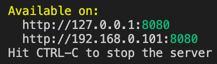
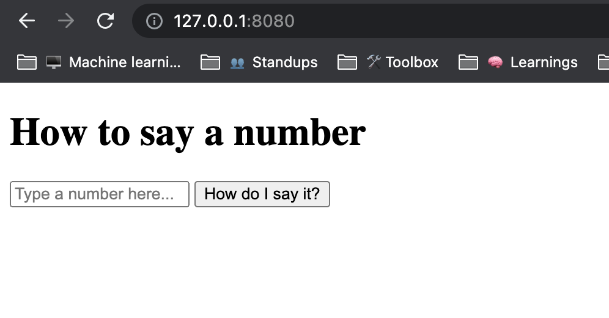

# Welcome to "Say the number!"
This is a simple program meant to help you say numbers (especially those very long ones!) in English.  It has a basic UI where you can enter any integer from 0 up to (but not including) a quadrillion, and it will output how to say that number.

## Setup
This project assumes you have Node installed (I can only vouch for v16).
To run this project locally, run this command:
```
npm ci
```
and then
```
npm run start
```
which will set up an HTTP server...
<div></div>
... that lets you access the program on `127.0.0.1:8080` \\(",)/
<div></div>

## Tests
To run the test suite:
```
npm run test
```

## Big-O space complexity
The space complexity for this algorithm is _O(n)_ because the main things that take up more/less space depending on the size of the input number are the two arrays that store information about the "triplet digits" that make up that number, e.g. for the number 12 583 102 102 001, there will be this array `[[12], [583], [102], [102], [1]]` and this array `[["twelve trillion"], ["five hundred and eighty three billion"], ["one hundred and two million"], ["one hundred and two thousand"], ["one"]]`.